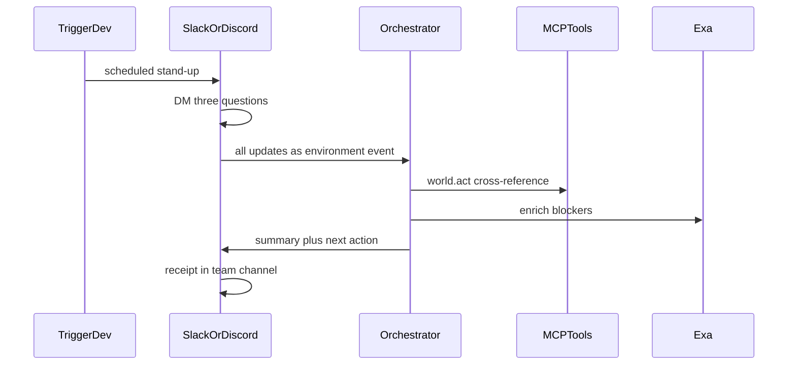

# StandUp

An AI teammate that runs your daily stand-up — inside **Slack and Discord**,
where your team already works.

Built for [Agents, Everywhere](https://nairobi.aitinkerers.org/p/agents-everywhere-bots-channels-more-global-hackathon)
(AI Tinkerers x OpenAI) — Nairobi.

| Field | Value |
| --- | --- |
| Who | Engineering teams that already stand up in Slack/Discord |
| Where | Slack DMs + channel · Discord DMs + channel |
| Why a chatbox dies | The agent needs **all teammates' updates in one place at once** — thread presence, who replied, who is named — a paste into ChatGPT will never be the morning ritual |
| Loop | schedule → DM three questions → collect → cross-reference → **receipt in the team channel** |
| Control | Approve before posting a suggested action · Stop cancels the job |

## Who this is for

A small product team that already lives in one Slack or Discord channel. They do not want another dashboard to check.

Most AI stand-up bots collect and format updates. StandUp Agent goes further:
it **reasons across teammates' updates** to catch blockers and dependencies
that nobody explicitly flagged — then tells the right person what to do next.

Three people in this walkthrough:

- **Eugene** — building the dashboard; waiting on an API
- **Brian** — finished the endpoint; has not sent the docs
- **Mustafa** — landing page and pitch; nothing blocked

The bot is a teammate in that workspace. It DMs people privately, then writes one message back to the **team channel**. The control-plane screen is theater for traces and approvals — **not** the home.

## A morning with StandUp

### 1. Stand-up starts

On weekdays at **08:00 Africa/Nairobi** the schedule fires. Anyone in the channel can also run `/standup`.

From the team's point of view: stand-up started. Nobody opens a web app. Nobody copies updates into a form.

### 2. Each person gets a DM

The bot opens a 1:1. It does not dump three questions at once. It asks, waits, then asks again:

1. What did you finish?
2. What are you working on?
3. What's blocking you?

Eugene's DM looks like this:

> **StandUp:** What did you finish?
>
> **Eugene:** Layout work on the dashboard.
>
> **StandUp:** What are you working on?
>
> **Eugene:** Still the dashboard.
>
> **StandUp:** What's blocking you?
>
> **Eugene:** Can't finish the dashboard until I get the API endpoint from Brian.

Brian and Mustafa get the same three questions in their own DMs.

### 3. People type what they know — not what others need

**Eugene**

- Finished: layout work on the dashboard
- Working on: the dashboard
- Blocking: waiting on Brian's API endpoint / docs

**Brian**

- Finished: the API endpoint
- Working on: cleanup on another ticket
- Blocking: nothing — he does not realize Eugene is waiting

**Mustafa**

- Finished: landing-page copy
- Working on: the pitch deck
- Blocking: nothing

The hidden dependency: Eugene named Brian. Brian did not reciprocate. A formatter would reprint three check-ins. The channel would still not know who should move.

### 4. One message in the team channel

When the last reply is in, **one** message lands in the shared channel — not a private report, not three threaded updates.

```
Stand-up summary

Dashboard development is blocked on API documentation. Brian has
completed the endpoint but hasn't shared it with Eugene yet.

Suggested action: Brian → send API docs to Eugene.

On track: Mustafa's landing-page / pitch work.
```

Suggested actions that ping a person can pause for **HITL** (Approve / Stop) before they go out.

### 5. What the agent did

- Connected Eugene's blocker to Brian's "I shipped it"
- Named a next action and an owner
- Dropped Mustafa's update as noise, not a third blocker

That connecting step — not summarizing, but *connecting* — is what makes this an agent rather than a formatter.

## Why this lives in Slack and Discord

Agents are leaving the chatbox. The questions, the wait, and the summary all happen where the team already works. Rip StandUp out of Slack/Discord and paste three updates into ChatGPT and you lose the morning ritual, who has not replied, and the cost of a wrong @mention. That is why a standalone chatbox dies.

## How the pieces support that morning

1. **Trigger.dev** starts the morning (or `/standup` does).
2. **Slack or Discord** DMs each teammate and is the channel receipt.
3. Replies become one environment event (and optionally land in **Supabase**).
4. The **orchestrator** sends all updates together to **OpenAI / OpenRouter**.
5. **Exa** can enrich a blocker with a PR or prior thread.
6. The bot posts the summary back to the **same** team channel.
7. Pings can pause for Approve / Stop on the control plane.



## What we are building (for role assignment)

**Frontend** is what a human sees: Slack/Discord, plus the optional mission-control UI.
**Backend** is the loop after replies exist: orchestrator, tools, model, schedule.

```
red/
├── apps/control-plane/     # frontend (theater) — traces, Approve / Stop
├── packages/orchestrator/  # backend — event → plan → tools → HITL → traces
├── packages/mcp-tools/     # backend — environment I/O, Exa, act+receipt, fail
├── prompts/                # backend — stand-up-aware prompts
└── docs/                   # pitch — judging, architecture, runbook, demo
```

Slack/Discord adapters (still to wire) plug into `ingestEnvironmentEvent`.
Do not demo only the control-plane screen.

### Backend

Owns the morning after the replies exist. Does not know Slack from Discord.

| Work package | What it is | Suggested owner |
| --- | --- | --- |
| Orchestrator | `packages/orchestrator` — ingest updates, plan, call the model, emit traces | Immaculate |
| Reasoning / prompts | OpenAI / OpenRouter + `prompts/` — find Eugene ↔ Brian, name `assignee → action` | Immaculate |
| MCP tools | `packages/mcp-tools` — environment I/O, Exa search, act+receipt, health/fail | Immaculate |
| Storage | Optional Supabase for today's answers | Immaculate |
| Schedule | Trigger.dev at 08:00 Africa/Nairobi (job stub in `jobs.ts` today) | Emmanuel |

### Frontend

Owns what a human sees and types.

| Work package | What a user sees | Suggested owner |
| --- | --- | --- |
| Slack adapter | 1:1 DMs (one question at a time), `/standup`, Block Kit channel receipt | Emmanuel |
| Discord adapter | Same flow: DMs, `/standup`, embed in the team channel | Emmanuel |
| Control plane | `apps/control-plane` — traces, Approve / Stop, two-minute video theater | Emmanuel |
| Product copy | Question wording, summary header, “Suggested action” line | Mustafa |

### Pitch / demo

| Work package | What it is | Suggested owner |
| --- | --- | --- |
| Story and demo | Walk judges through this morning; hit the hidden dependency | Mustafa |
| Docs | `docs/04-demo-script.md`, sponsor one-liners, social post | Mustafa |

Change names in the tables if you reassign. The cut is: **orchestrator + tools = backend**, **adapters + control plane = frontend**, **docs + walkthrough = pitch**.

## If something goes wrong

- Someone never answers: the channel stays quiet; stand-up is still collecting.
- The model is down: the fixture still names Brian → Eugene from the obvious name mention.
- No Exa key: the same summary posts, with no extra link.
- A suggested ping is risky: HITL pauses for Approve / Stop.

## Repo layout (runnable kit)

See [`docs/02-architecture.md`](docs/02-architecture.md) and
[`docs/05-standup-agent.md`](docs/05-standup-agent.md).

## Run

```bash
cp .env.example apps/control-plane/.env.local
npm install
npm run dev
```

Open [http://localhost:3000](http://localhost:3000).

- **Run fixture loop** — Eugene/Brian/Amina stand-up → act → channel receipt
- **Pause for HITL** — Approve / Stop before a suggested action
- **Force fail + retry** — demo the failure beat

```bash
npm run loop          # CLI: one stand-up fixture
npm run loop:fail
npm run loop:hitl
npm run mcp           # stdio MCP tool server
```

Empty API keys are honest stubs. Set keys before you film for a higher
Technical Execution score.

## Demo script (two minutes)

See [`docs/04-demo-script.md`](docs/04-demo-script.md). Film order:

1. Slack/Discord channel (or fixture that *looks* like it)
2. Three DM replies with the hidden Eugene↔Brian dependency
3. Agent acts → summary **receipt in the channel**
4. Fail → retry → Stop
5. Two breaths of mission control
6. One line: this dies in a standalone chatbox

## Team

Starting split (change names in the tables above if you reassign):

- **Immaculate Munde** — Backend: orchestrator, prompts, MCP tools, OpenAI/Exa
- **Emmanuel** — Frontend: Slack + Discord adapters, control plane; Trigger.dev
- **Mustafa** — Pitch, demo walkthrough, product copy

## Submission checklist

1. Title — StandUp Agent
2. Written description — who, Slack/Discord, why context matters
3. Public GitHub — this repo
4. Two-minute video
5. Social post tagging OpenAI, CopilotKit, OpenRouter, Exa, Trigger.dev, Auth0, Mozilla, Ambiguous

## License

MIT. See [LICENSE](LICENSE).
