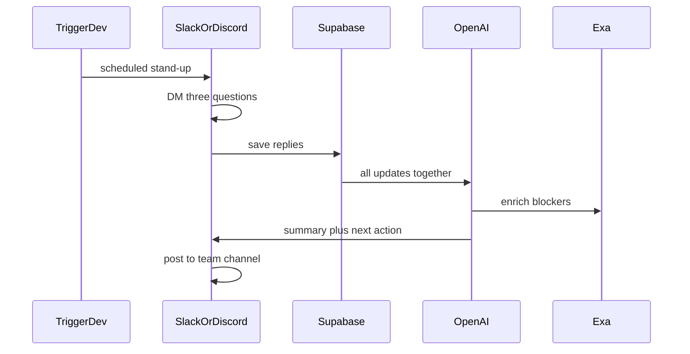

# StandUp Agent

An AI teammate that runs your daily stand-up — inside Slack and Discord, where your team already works.

Built for [AI Tinkerers Hackathon](https://aitinkerers.org/) — Nairobi.

## The idea

Most AI stand-up bots collect and format updates. StandUp Agent goes further: it **reasons across teammates' updates** to catch blockers and dependencies that nobody explicitly flagged — then tells the right person what to do next.

That cross-referencing step — not just summarizing, but *connecting* — is what makes this an agent rather than a formatter.

### Example

> **Eugene:** "Can't finish the dashboard until I get the API endpoint from Brian."
>
> **Brian:** "API endpoint is done, just haven't sent Eugene the docs yet."

StandUp connects the two and posts to the channel:

> **Stand-up summary**
>
> Dashboard development is blocked on API documentation. Brian has completed the endpoint but hasn't shared it with Eugene yet.
>
> **Suggested action:** Brian → send API docs to Eugene.
>
> Everything else is on track.

Teams don't need another dashboard to check. Agents are leaving the chatbox — StandUp shows up in Slack and Discord, asks three questions at a set time, and does the thinking so the team doesn't have to piece it together manually.

## How it works

1. **Trigger.dev** fires a scheduled job each morning.
2. The bot **DMs each teammate** three questions:
   - What did you finish?
   - What are you working on?
   - What's blocking you?
3. Replies are stored in **Supabase**.
4. Once responses are in, all of them are sent together to an **LLM** (OpenAI) for cross-referencing — detecting explicit blockers, implicit dependencies (someone mentioned but who didn't reciprocate), and overdue items.
5. **Exa** can enrich a blocker with already-resolved context (a PR, a prior thread) before the summary goes out.
6. The bot posts a **formatted summary** back to the team channel, with a suggested next action if something is blocked.



## Architecture

Monorepo, shared core logic, two thin platform adapters:

```
standup-agent/
├── packages/
│   ├── core/              # platform-agnostic: scheduling, reasoning, storage
│   ├── slack-adapter/     # Slack Bolt app — DMs, channel posts, Block Kit
│   └── discord-adapter/   # discord.js bot — DMs, channel posts, embeds
```

The reasoning engine does not know or care which platform an update came from. Both adapters ask questions, collect answers, and hand off to the same `core` logic. One team, two front doors.

## Tech stack

- **OpenAI** — core reasoning: blocker and dependency detection across teammates' updates
- **Exa** — enrich blockers with repo/history context and relevant links (for example a PR)
- **Trigger.dev** — scheduled daily stand-up trigger
- **Auth0** — auth for an optional web dashboard (stand-up history)
- **Google Cloud Run** — backend deploy
- **Slack (Bolt SDK)** — messaging adapter
- **Discord (discord.js)** — messaging adapter
- **Supabase** — team data and daily responses

## Demo script

1. Three teammates receive the daily DM prompt.
2. Two of them have a hidden dependency (one mentions waiting on the other; the other does not realize they are needed).
3. The third has a routine, unrelated update — no blockers.
4. StandUp posts the summary: correctly isolates the real blocker, ignores the noise, and suggests the specific next action.

## Team

- **Immaculate Munde** — Technical (agent logic, integrations)
- **Emmanuel** — Technical
- **Mustafa** — Business / pitch

## Status

Hackathon MVP — README and spec first; implementation next.

Adapters are not runnable yet. Do not expect `pnpm` workspace commands to start Slack or Discord bots.

## Environment keys to collect

Implementation is not started. Teammates can gather these keys in the meantime:

- `OPENAI_API_KEY`
- `EXA_API_KEY`
- `SLACK_BOT_TOKEN`
- `SLACK_SIGNING_SECRET`
- `DISCORD_BOT_TOKEN`
- `SUPABASE_URL`
- `SUPABASE_ANON_KEY`
- `TRIGGER_API_KEY`

## License

MIT. See [LICENSE](LICENSE).
