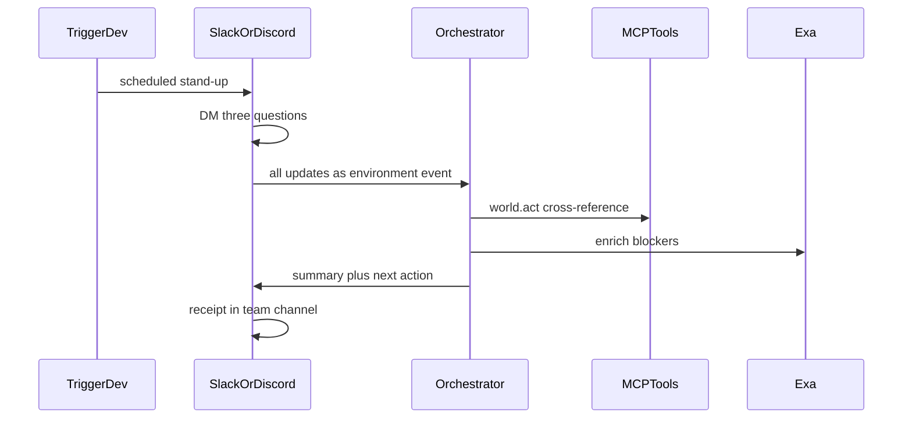

# StandUp Agent

An AI teammate that runs your daily stand-up — inside **Slack and Discord**,
where your team already works.

Built for [Agents, Everywhere](https://nairobi.aitinkerers.org/p/agents-everywhere-bots-channels-more-global-hackathon)
(AI Tinkerers x OpenAI) — Nairobi.

| Field | Value |
| --- | --- |
| Who | Engineering teams that already stand up in Slack/Discord |
| Where | Slack DMs + channel · Discord DMs + channel |
| Why a chatbox dies | The agent needs **all teammates' updates in one place at once** — thread presence, who replied, who is named — a paste into ChatGPT will never be the morning ritual |
| Loop | schedule → DM three questions → collect → cross-reference → **receipt in the team channel** |
| Control | Approve before posting a suggested action · Stop cancels the job |

---

## The idea

Most AI stand-up bots collect and format updates. StandUp Agent goes further:
it **reasons across teammates' updates** to catch blockers and dependencies
that nobody explicitly flagged — then tells the right person what to do next.

That cross-referencing step — not just summarizing, but *connecting* — is
what makes this an agent rather than a formatter.

### Example

> **Eugene:** "Can't finish the dashboard until I get the API endpoint from Brian."
>
> **Brian:** "API endpoint is done, just haven't sent Eugene the docs yet."

StandUp connects the two and posts to the channel:

> **Stand-up summary**
>
> Dashboard development is blocked on API documentation. Brian has completed
> the endpoint but hasn't shared it with Eugene yet.
>
> **Suggested action:** Brian → send API docs to Eugene.
>
> Everything else is on track.

---

## How it works

1. **Trigger.dev** fires a scheduled job each morning.
2. The bot **DMs each teammate** three questions (finished / working on / blocked).
3. Replies land in the environment (and optionally **Supabase**).
4. Updates go together to an **LLM** (OpenAI / OpenRouter) for cross-referencing.
5. **Exa** can enrich a blocker with a PR or prior thread before the summary goes out.
6. The bot posts a **formatted summary** back to the **same** team channel.
7. Suggested actions that ping a person can pause for **HITL** (Approve / Stop).



---

## Repo layout (runnable kit)

```
red/
├── apps/control-plane/     # Vengeance UI mission control — theater, NOT the home
├── packages/orchestrator/  # environment event → plan → tools → HITL → traces
├── packages/mcp-tools/     # MCP: environment I/O, Exa search, act+receipt, health/fail
├── prompts/                # stand-up-aware judge-aligned prompts
└── docs/                   # judging decoder, architecture, day-of runbook, demo script
```

Slack/Discord adapters plug into `ingestEnvironmentEvent`. The control plane
is for traces, approvals, and the two-minute video — **do not demo only that screen**.

---

## Run

```bash
cp .env.example apps/control-plane/.env.local
npm install
npm run dev
```

Open [http://localhost:3000](http://localhost:3000).

- **Run fixture loop** — Eugene/Brian/Amina stand-up → act → channel receipt
- **Pause for HITL** — Approve / Stop before a suggested action
- **Force fail + retry** — demo the failure beat

```bash
npm run loop          # CLI: one stand-up fixture
npm run loop:fail
npm run loop:hitl
npm run mcp           # stdio MCP tool server
```

Empty API keys are honest stubs. Set keys before you film for a higher
Technical Execution score.

---

## Tech stack

| Piece | Role |
| --- | --- |
| OpenAI / OpenRouter | Cross-reference blockers and dependencies |
| Exa | Enrich blockers with repo/history links |
| Trigger.dev | Morning schedule (job stub in orchestrator today) |
| Auth0 | Optional dashboard principals |
| Slack Bolt / Discord.js | Environment adapters (to wire on the day) |
| Supabase | Persist daily responses (optional) |
| CopilotKit / AG-UI | Hook points in `packages/orchestrator/src/ag-ui.ts` |
| Vengeance UI | Control-plane theater |

---

## Demo script (two minutes)

See [`docs/04-demo-script.md`](docs/04-demo-script.md). Film order:

1. Slack/Discord channel (or fixture that *looks* like it)
2. Three DM replies with the hidden Eugene↔Brian dependency
3. Agent acts → summary **receipt in the channel**
4. Fail → retry → Stop
5. Two breaths of mission control
6. One line: this dies in a standalone chatbox

---

## Team

- **Immaculate Munde** — Technical (agent logic, integrations)
- **Emmanuel** — Technical
- **Mustafa** — Business / pitch

## Submission checklist

1. Title — StandUp Agent
2. Written description — who, Slack/Discord, why context matters
3. Public GitHub — this repo
4. Two-minute video
5. Social post tagging OpenAI, CopilotKit, OpenRouter, Exa, Trigger.dev, Auth0, Mozilla, Ambiguous

## License

MIT. See [LICENSE](LICENSE).
