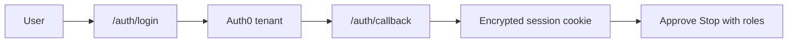

# Auth0 setup (StandUp control plane)

Why Auth0 exists here (the badge on Send / Hold):
[`08-how-the-pieces-fit.md`](08-how-the-pieces-fit.md#auth0--the-badge).

Login request path diagram: [`10-workflows.md`](10-workflows.md#7-auth0-request-path).

After Vercel deploy, set production URLs — see
[`09-vercel-deploy.md`](09-vercel-deploy.md#5-point-auth0-at-production).



---

## 1. Create the Auth0 app

1. Auth0 Dashboard → Applications → Create Application
2. Type: **Regular Web Application**
3. Technology: **Next.js**

## 2. URLs

Replace `YOUR_VERCEL_URL` after the first deploy (e.g. `https://standup-xxx.vercel.app`).

| Setting | Values |
| --- | --- |
| Allowed Callback URLs | `http://localhost:3000/auth/callback`, `https://YOUR_VERCEL_URL/auth/callback` |
| Allowed Logout URLs | `http://localhost:3000`, `https://YOUR_VERCEL_URL` |
| Allowed Web Origins | `http://localhost:3000`, `https://YOUR_VERCEL_URL` |

## 3. Environment variables

```bash
openssl rand -hex 32   # → AUTH0_SECRET
```

| Var | Value |
| --- | --- |
| `AUTH0_SECRET` | output of openssl |
| `AUTH0_DOMAIN` | `your-tenant.auth0.com` (no https) |
| `AUTH0_ISSUER_BASE_URL` | `https://your-tenant.auth0.com` |
| `AUTH0_CLIENT_ID` | from Auth0 app |
| `AUTH0_CLIENT_SECRET` | from Auth0 app |
| `APP_BASE_URL` / `AUTH0_BASE_URL` | production URL |
| `AUTH0_REQUIRE_AUTH` | `1` to lock the dashboard |

Without these, the app runs in **local persona** mode (Lead Engineer) so
demos still work. Code: `apps/control-plane/src/lib/auth.ts` +
`apps/control-plane/src/middleware.ts`.

## 4. Optional RBAC

Add a custom claim `https://standup.agent/roles` via an Auth0 Action on Login, e.g. `["tech-lead","admin"]`. HITL approvals use those roles.
