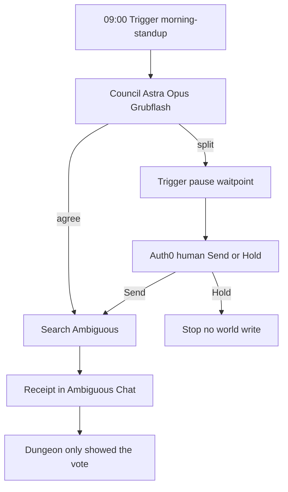

# How the pieces fit

Say this before you say any product name: **the office, the clock, the
vote, the badge.**

| Piece | One sentence |
| --- | --- |
| **Ambiguous** | The office — where the agent reads and writes, like a teammate. |
| **Trigger.dev** | The clock — starts the morning, retries failures, pauses for a human. |
| **The Dungeon** | The window — three models, a yes/no. Not where the work lands. |
| **Auth0** | The badge — who is allowed to hit Send. |

If you close our dashboard and the stand-up still happened, you used the
first two. The last two are how you *watch* and *unlock*.

Setup walkthroughs stay in their own files:
[`06-ambiguous-setup.md`](06-ambiguous-setup.md),
[`07-deployment.md`](07-deployment.md),
[`07-auth0-setup.md`](07-auth0-setup.md),
[`09-vercel-deploy.md`](09-vercel-deploy.md),
[`10-workflows.md`](10-workflows.md) (Mermaid).

---

## Ambiguous — the office

We do not host the agent there. There is nowhere to upload
`packages/orchestrator`. Ambiguous is a workspace with an API. Our agent
calls it the way a colleague uses Chat, Wiki, Tasks, and Calendar.

Five writes earn their place:

| What | Why |
| --- | --- |
| **Chat** | The stand-up summary lands in the team channel (`general` — no `#`). |
| **Search** | Before we repeat “Eugene is blocked on Brian’s docs,” we look. If the doc exists, we link it. |
| **Wiki** | That evidence is a real page. The daily log can go here too. |
| **Tasks** | A follow-up is owned by a named person. |
| **Calendar** | Two people who are stuck get a short hold, not another ping. |

The money shot: Eugene says he is waiting. Search finds Brian’s page.
The receipt **links the page** instead of nagging Brian. A chatbot never
does that, because it was never in the office.

**Finding Chat on demo day.** Ambiguous is 17 apps. Open
[app.ambiguous.ai](https://app.ambiguous.ai) → **Chat** (not Wiki, not
Home) → **general**. Or `Ctrl+K` / `Cmd+K` and type `general`. Wiki →
Home → *Payments API — endpoint reference* is the backup if Chat is
confusing on stage.

The agent runs on our laptop or Trigger. Ambiguous is only where the
work **shows up**. If the laptop dies after the receipt posted, the
message is still in the channel.

---

## Trigger.dev — the clock

Think of it as a timer and a pause button that live in the cloud, not
on the laptop.

Without it, the agent only runs when someone opens the site and clicks.
Close the laptop, no stand-up. One failed model call, the run dies.
Council disagrees, you have to sit there and wait.

Trigger does three jobs even if nobody has the dashboard open.

**1. It starts the morning by itself.**

Weekdays, 09:00 Africa/Nairobi (`morning-standup`). A teammate’s Slack
kick is 08:00 (`daily-standup`). Both are crons on Trigger’s servers.
You do not click anything.

**2. If something breaks, it tries again.**

DeepSeek times out, or Ambiguous is briefly down. Trigger waits, then
runs the same job (attempt 2, then 3). A `setTimeout` in our process
dies when the server sleeps. Theirs does not.

**3. If a human must decide, it waits.**

Council splits. The job **freezes** (a waitpoint). Hours later someone
hits Send in the Dungeon. Trigger **wakes the same run**. Timeout means
do not act.

Pitch line: *Ambiguous is where the agent writes. Trigger is when it
runs, that it retries, and that it can pause for you.*

Local: `npm run trigger:dev`. Cloud: `npm run trigger:deploy`. Env vars
do not travel from `.env.local` — set them again in the Trigger
dashboard. See [`07-deployment.md`](07-deployment.md).

---

## The Dungeon — the window

`/dungeon` is how you *watch* the three models. It is not the office.

| Cell | Model | Temperament |
| --- | --- | --- |
| **Astra** | GPT | Commits hard |
| **Opus** | Opus | Hedges |
| **Grubflash** | DeepSeek | Usually still awake |

Each reads the stand-up alone. Same input, no peeking.

- They **agree** → the agent acts. “Agreed. Sent.”
- They **split** → it stops. The message plus **Send** or **Hold**.
- Two are **asleep** (quota) → the page says so. We do not fake a full council.

That is the whole page. Receipts and calendar holds still live in
Ambiguous.

**Do not use Dungeon → Run to demo Ambiguous.** That button starts the
Slack stand-up path (`/api/kick-standup`). The write into Ambiguous
comes from Mission Control ingest (or `npm run loop`). Dungeon **Send**
/ **Hold** *are* real: they resolve the HITL gate.

Seeded cells carry a `demo` badge. Do not call those a live council.

---

## Auth0 — the badge

When the council splits, unlocking the gate is not “anyone with the
URL.”

- You **sign in**. A named person, not a shared password.
- **Roles** decide if you can approve (tech-lead / admin) or get blocked.
- **Orgs** keep one company’s stand-ups off another company’s board.

The receipt can then say *who* approved. Same idea as the agent needing
its own Ambiguous account: identity on both sides.

Without Auth0 env vars the app uses a local “Lead Engineer” persona so
the laptop demo still works. Wiring: [`07-auth0-setup.md`](07-auth0-setup.md).

---

## How a morning actually goes



ASCII fallback:

```
09:00  Trigger fires morning-standup
         │
         ▼
       Council (Astra / Opus / Grubflash) each read the replies
         │
         ├── agree     → search Ambiguous → post / task / hold
         └── split     → Trigger pauses → Auth0 human hits Send or Hold
                              │
                              ▼
                         Receipt in Ambiguous Chat
                         (Dungeon only showed the vote)
```

If a judge asks “why not just Slack + ChatGPT?”: Slack can be a front
door. Ambiguous is where the doc, the task, and the calendar hold share
one identity, so a blocker can be **checked** instead of repeated.
Trigger is why that check happens on Monday when nobody opened our UI.

---

## Pitch, 45 seconds

Stand-up is a daily tax. Chatbots summarize it. We finish it.

Business tools already have the data. They do not have an agent that
**checks** it and **closes** the loop. We sit in Ambiguous like a
teammate, wake up on Trigger, and only tap a human — a named Auth0
user — when three models cannot agree. The product is the message in
`general` and the calendar hold. The Dungeon is how you see the vote.
