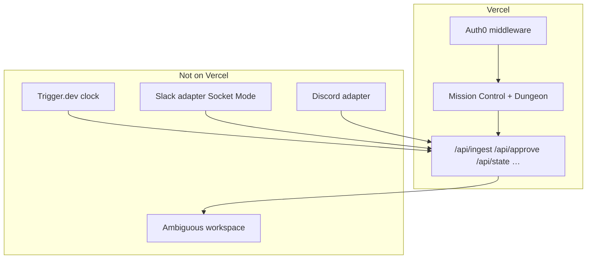
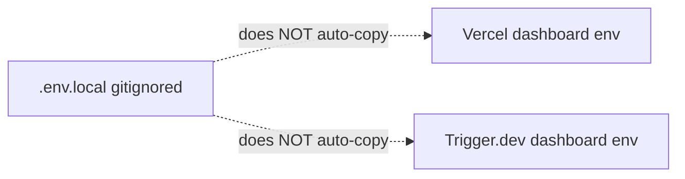
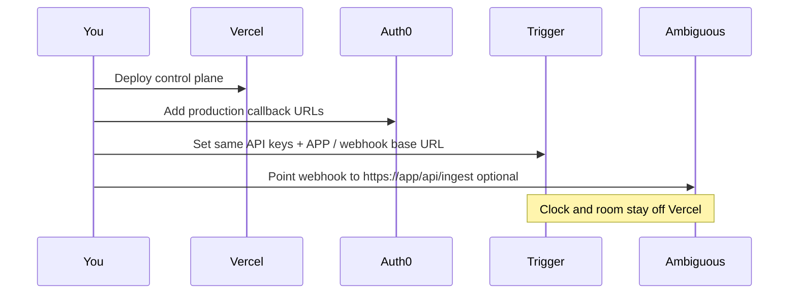

# Vercel deployment guide

Step-by-step deploy for the **StandUp control plane** (`apps/control-plane`).
You run this yourself. This file is the checklist.

Related:

- System map: [`08-how-the-pieces-fit.md`](08-how-the-pieces-fit.md)
- Workflows (Mermaid): [`10-workflows.md`](10-workflows.md)
- Auth0: [`07-auth0-setup.md`](07-auth0-setup.md)
- Where each piece runs: [`07-deployment.md`](07-deployment.md)

---

## What you are deploying



| Deploy here | Do **not** deploy here |
| --- | --- |
| Next.js UI + HTTP APIs | Slack/Discord Socket Mode bots |
| Auth0 session routes | Long council tool loops (use Trigger) |
| Webhook receivers | In-memory store as source of truth forever |

Repo already has [`vercel.json`](../vercel.json) at the monorepo root.

---

## Prerequisites

1. Node **≥ 20**
2. [Vercel account](https://vercel.com/signup) (Hobby is fine)
3. [Vercel CLI](https://vercel.com/docs/cli): `npm i -g vercel` or `npx vercel`
4. Local build green:

```bash
cd /path/to/red
npm install
npm run build
```

5. Auth0 app ready (optional for first deploy; required for real login) — see [`07-auth0-setup.md`](07-auth0-setup.md)

---

## Option A — Dashboard (recommended)

### 1. Import the repo

1. [vercel.com/new](https://vercel.com/new)
2. Import `redbull93/red` (or your fork)
3. Install the [Vercel GitHub App](https://github.com/apps/vercel) if asked

### 2. Project settings

Use **one** of these layouts:

**Layout 1 — Root = monorepo root (matches `vercel.json`)**

| Setting | Value |
| --- | --- |
| Framework Preset | Next.js |
| Root Directory | `.` (repo root) |
| Install Command | `npm install` |
| Build Command | `npm run build --workspace=control-plane` |
| Output Directory | `apps/control-plane/.next` |

**Layout 2 — Root = `apps/control-plane`**

| Setting | Value |
| --- | --- |
| Root Directory | `apps/control-plane` |
| Install Command | `cd ../.. && npm install` |
| Build Command | `cd ../.. && npm run build --workspace=control-plane` |
| Output Directory | `.next` |

Include files outside root (workspace packages): enable **Include source files outside of the Root Directory** if Vercel shows that toggle.

### 3. Environment variables

In **Project → Settings → Environment Variables**, add at least:

| Variable | Required for | Notes |
| --- | --- | --- |
| `APP_BASE_URL` | Auth0 + links | `https://YOUR_PROJECT.vercel.app` |
| `AUTH0_BASE_URL` | Auth0 | Same as `APP_BASE_URL` |
| `AUTH0_SECRET` | Auth0 | `openssl rand -hex 32` |
| `AUTH0_DOMAIN` | Auth0 | `tenant.auth0.com` (no `https://`) |
| `AUTH0_ISSUER_BASE_URL` | Auth0 | `https://tenant.auth0.com` |
| `AUTH0_CLIENT_ID` | Auth0 | Application Client ID |
| `AUTH0_CLIENT_SECRET` | Auth0 | Application secret |
| `AUTH0_REQUIRE_AUTH` | Lock UI | `0` first deploy; `1` after Auth0 works |
| `AGENT_ROUTER_API_KEY` | Council | Or fall back to OpenAI/OpenRouter |
| `AMBIGUOUS_API_KEY` | Receipts | Agent member key, not a human key |
| `AMBIGUOUS_STANDUP_CHANNEL` | Receipts | Channel id |
| `EXA_API_KEY` | Enrichment | Optional |
| `ALLOW_DEMO_SEED` | Demo seed API | Keep `0` in production |

Copy the full list from [`.env.example`](../.env.example). Set them for **Production** (and Preview if you want).



### 4. Deploy

Click **Deploy**. Wait for the build log. First green build gives you:

`https://<project>.vercel.app`

### 5. Point Auth0 at production

In Auth0 Application settings, add:

| Setting | Value |
| --- | --- |
| Allowed Callback URLs | `https://YOUR_PROJECT.vercel.app/auth/callback` |
| Allowed Logout URLs | `https://YOUR_PROJECT.vercel.app` |
| Allowed Web Origins | `https://YOUR_PROJECT.vercel.app` |

Then set `APP_BASE_URL` / `AUTH0_BASE_URL` to that URL and redeploy (or wait for next push).

### 6. Smoke test

```text
GET  https://YOUR_PROJECT.vercel.app/api/health
GET  https://YOUR_PROJECT.vercel.app/api/state
GET  https://YOUR_PROJECT.vercel.app/auth/login   # if Auth0 configured
```

Open `/` (Mission Control) and `/dungeon`. Sign in if `AUTH0_REQUIRE_AUTH=1`.

---

## Option B — CLI

```bash
cd /path/to/red
npx vercel login
npx vercel link          # pick team + create/link project "standup-agent"
npx vercel env pull .env.vercel.local   # optional sync check
```

Push env vars (example):

```bash
# After openssl rand -hex 32
echo -n "$SECRET" | npx vercel env add AUTH0_SECRET production
npx vercel env add APP_BASE_URL production
# …repeat for other keys, or paste in the dashboard (faster)
```

Deploy:

```bash
npx vercel deploy --prod
```

CLI uses [`vercel.json`](../vercel.json) at the repo root.

---

## Post-deploy wiring



1. **Trigger.dev** — `npm run trigger:deploy`; set env in Trigger dashboard (same keys as Vercel for router / Ambiguous).
2. **Ambiguous webhook** (optional) — `https://YOUR_PROJECT.vercel.app/api/ingest`.
3. **Slack/Discord** — keep Socket Mode on Railway/Fly/Render or a laptop; they are not serverless-friendly.
4. **Supabase** — if you need store survival across cold starts, wire `SUPABASE_*` before treating production as durable.

---

## Build failures checklist

| Symptom | Fix |
| --- | --- |
| `Cannot find module '@red/…'` | Install from monorepo root; do not set Root Directory to `apps/control-plane` without including workspaces |
| Auth0 middleware crash | Missing `AUTH0_SECRET` / client keys → either set all Auth0 vars or leave them empty for local-persona mode |
| Empty board after refresh | In-memory `globalThis` store — expected on serverless; seed via API only with `ALLOW_DEMO_SEED=1`, or use Supabase |
| Council timeouts on Vercel | Long loops belong on Trigger.dev, not a Vercel function |
| 401 on `/auth/login` | Callback URL mismatch in Auth0; `APP_BASE_URL` must match the live host |
| **403** `You don't have permission to create a Production Deployment` | Your Vercel team role cannot ship production. Use an account with deploy rights, ask a team admin to raise your role, or deploy to **Preview** first (`npx vercel` without `--prod`) — see [team roles](https://vercel.com/docs/accounts/team-members-and-roles) |
| **400** GitHub link / “install the GitHub integration” | Install the [Vercel GitHub App](https://github.com/apps/vercel) on `redbull93/red` (or your fork), then re-import the repo in the Vercel dashboard |

Local verify before pushing:

```bash
rm -rf apps/control-plane/.next
npm run build
```

---

## Agent / CLI deploy notes

Automated deploys from this machine hit two walls you must clear in the browser:

1. **GitHub ↔ Vercel:** https://github.com/apps/vercel → install on the `red` repo  
2. **Production permission:** team `tazos-projects-e0fd6b75` must allow your user to create Production Deployments  

Dashboard import + Deploy (Option A above) is the reliable path once those two are fixed.
---

## Security notes

- Never commit `.env.local`
- Prefer `AUTH0_REQUIRE_AUTH=1` once login works
- Keep `ALLOW_DEMO_SEED=0` in production
- Rotate `AUTH0_CLIENT_SECRET` if it was ever pasted into chat or screenshots

---

## Done when

- [ ] `npm run build` passes locally
- [ ] Production URL loads Mission Control
- [ ] `/api/health` returns OK
- [ ] Auth0 login/logout works (or explicit local persona)
- [ ] Trigger.dev env matches production keys
- [ ] Judges can open the URL without your laptop
