# Workflows

End-to-end StandUp flows with Mermaid. Read
[`08-how-the-pieces-fit.md`](08-how-the-pieces-fit.md) for the plain-language
map (office / clock / vote / badge).

---

## 1. System context

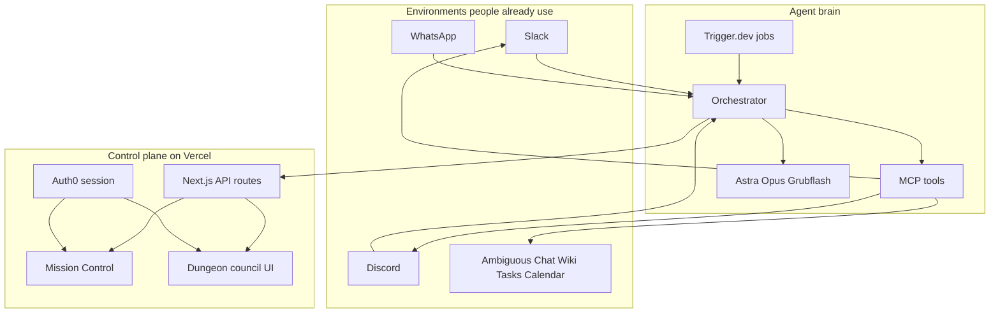

---

## 2. Morning stand-up happy path

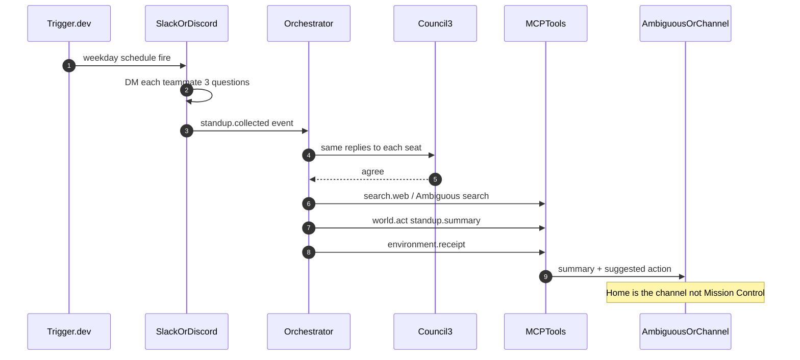

---

## 3. Hidden dependency example Eugene ↔ Brian

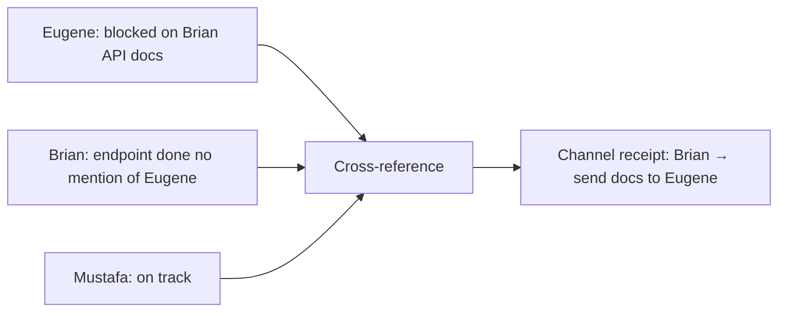

A formatter reprints three check-ins. StandUp **connects** them and posts
**one** receipt where the team already reads.

---

## 4. Council split → HITL → Auth0

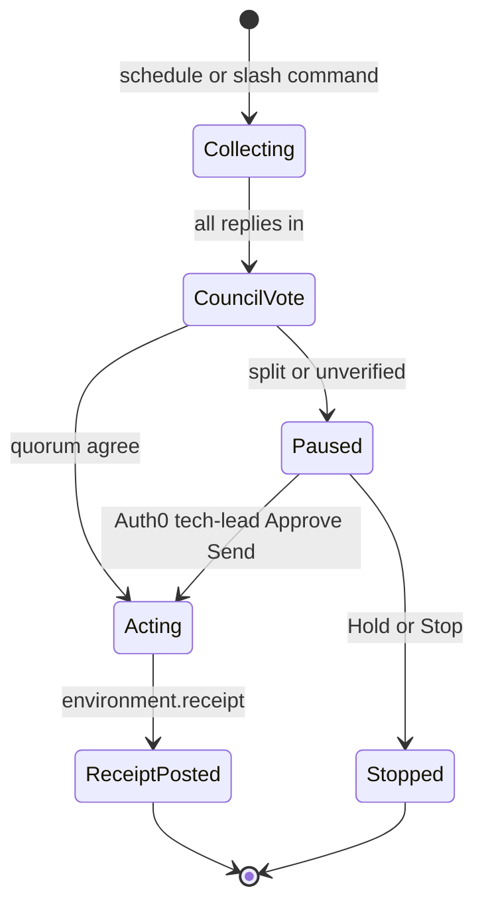

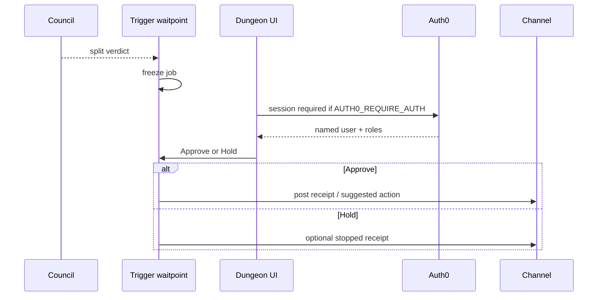

---

## 5. Fail → retry → stop

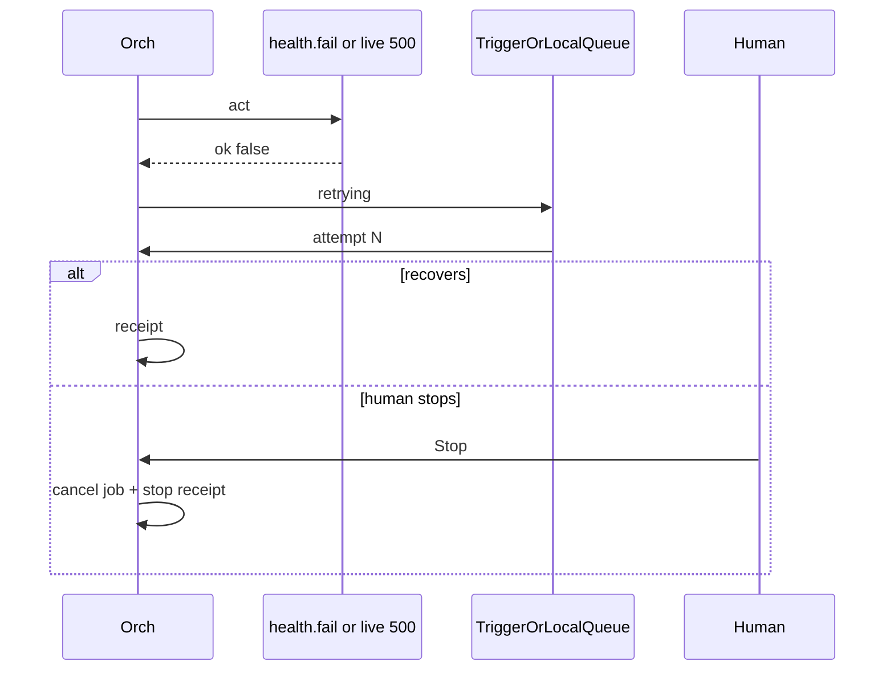

Demo beat: Mission Control **Force fail + retry**, then **Stop**.

---

## 6. Ingest API path Mission Control

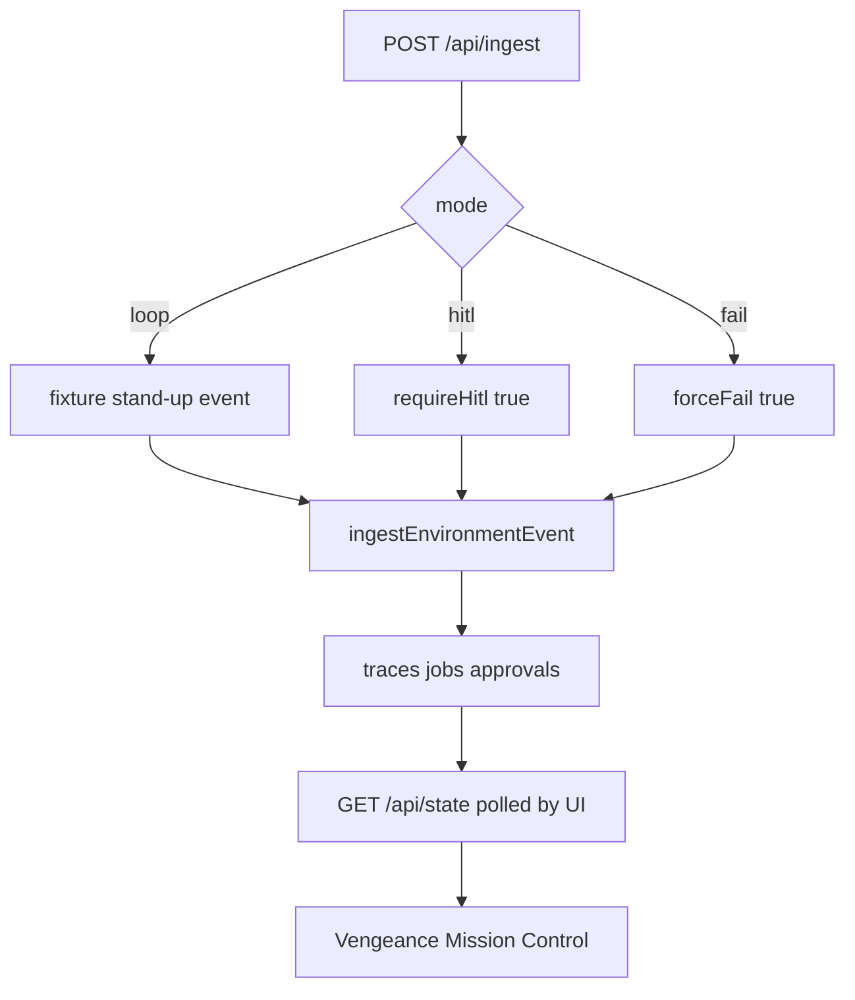

Remember: this UI is **theater**. The product receipt must still land in
Slack / Discord / Ambiguous.

---

## 7. Auth0 request path

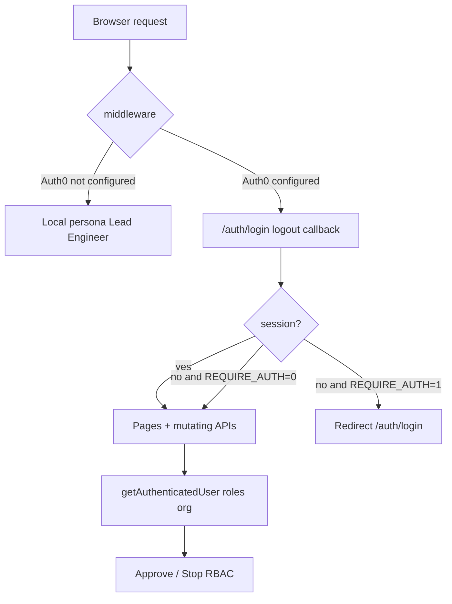

Details: [`07-auth0-setup.md`](07-auth0-setup.md).

---

## 8. Deploy topology

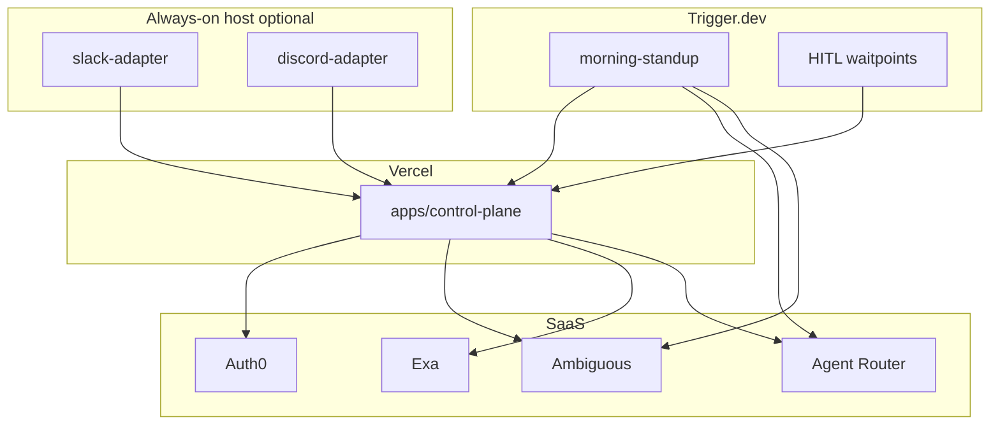

Step-by-step Vercel: [`09-vercel-deploy.md`](09-vercel-deploy.md).

---

## 9. Repo map

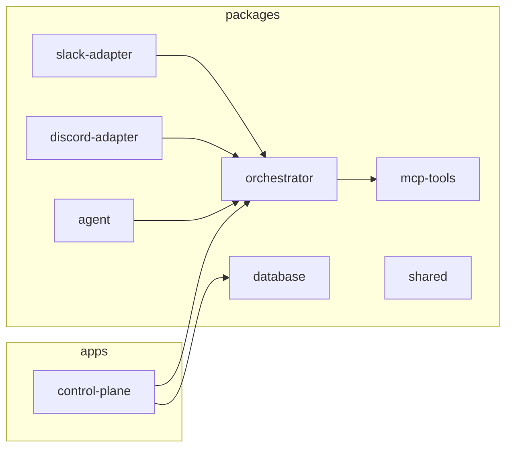

| Path | Role |
| --- | --- |
| `apps/control-plane` | Next.js UI + APIs + Auth0 middleware |
| `packages/orchestrator` | Event → council → tools → HITL → traces |
| `packages/mcp-tools` | environment I/O, Exa, act+receipt, Ambiguous |
| `packages/slack-adapter` | Socket Mode bot + `/standup` |
| `packages/discord-adapter` | Discord bot |
| `packages/database` | Supabase / memory queries |
| `prompts/` | System, council, HITL, tool policy |
| `docs/` | Judging, deploy, workflows |

---

## 10. Demo-day minimal workflow

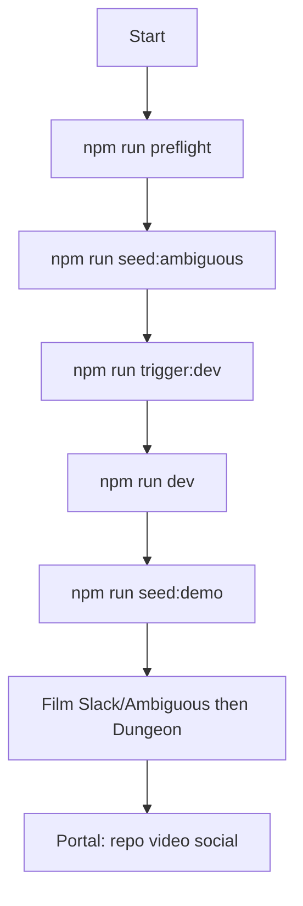

Full clock: [`03-day-of-runbook.md`](03-day-of-runbook.md).  
Film script: [`04-demo-script.md`](04-demo-script.md).
